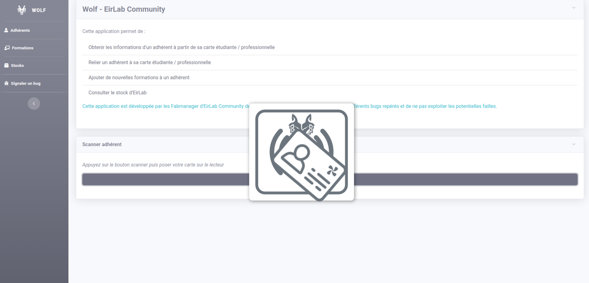
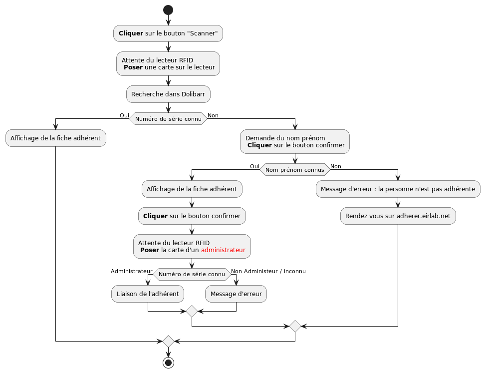

Adhérents
===========================================================

.. versionadded:: 0.1

    Le module adhérent permet d'obtenir les informations d'un adhérent à partir de sa carte étudiante / professionnelle.

.. versionadded:: 0.2

    Relier un adhérent à une carte étudiante / professionnelle.

    Signale aux adhérents l'expiration de leur adhésion.

Utilisation
-----------

Pour initier le module appuyez sur le bouton "Scanner", lorsque le logo de Wolf apparaît posez la carte étudiante / professionnelle sur le lecteur, celui ici emet un signal sonore lorsque la carte est lue.

    Attente de scan d'une carte

À l'issue du scan de la carte plusieurs scénarios peuvent se produire :

1. L'adhérent est reconnu : les informations de l'adhérent sont affichées, les formations qu'il a acquis sont en **couleur**, et les formations qu'il n'a pas encore acquis sont en **noir et blanc**.

.. figure:: ../img/adherent_reconnu.png
    :class: with-shadow
    :align: center

    Affichage de la fiche d'un adhérent

2. L'adhérent n'est pas reconnu : un formulaire demandant son nom et son prénom est affiché. Il faut le remplir et appuyer sur "Rechercher"

2.1. L'adhérent est reconnu, ses informations s'affichent mais sa carte n'est pas reliée à son compte. Pour le relier, il faut appuyer sur le bouton confirmer et poser la carte d'un **membre du conseil d'administration** sur le lecteur.

    .. figure:: ../img/adherent_reconnu_non_relie.png
        :class: with-shadow
        :align: center

        Affichage de la fiche d'un adhérent non lié

2.2 L'adhérent n'est pas reconnu, un message d'erreur est affiché.

    .. figure:: ../img/adherent_non_reconnu.png
        :class: with-shadow
        :align: center

        Affichage d'un message d'erreur

SDK
----

    Diagramme d'activité du module adhérent

.. automodule:: member
    :members:
    :undoc-members:
    :show-inheritance:

