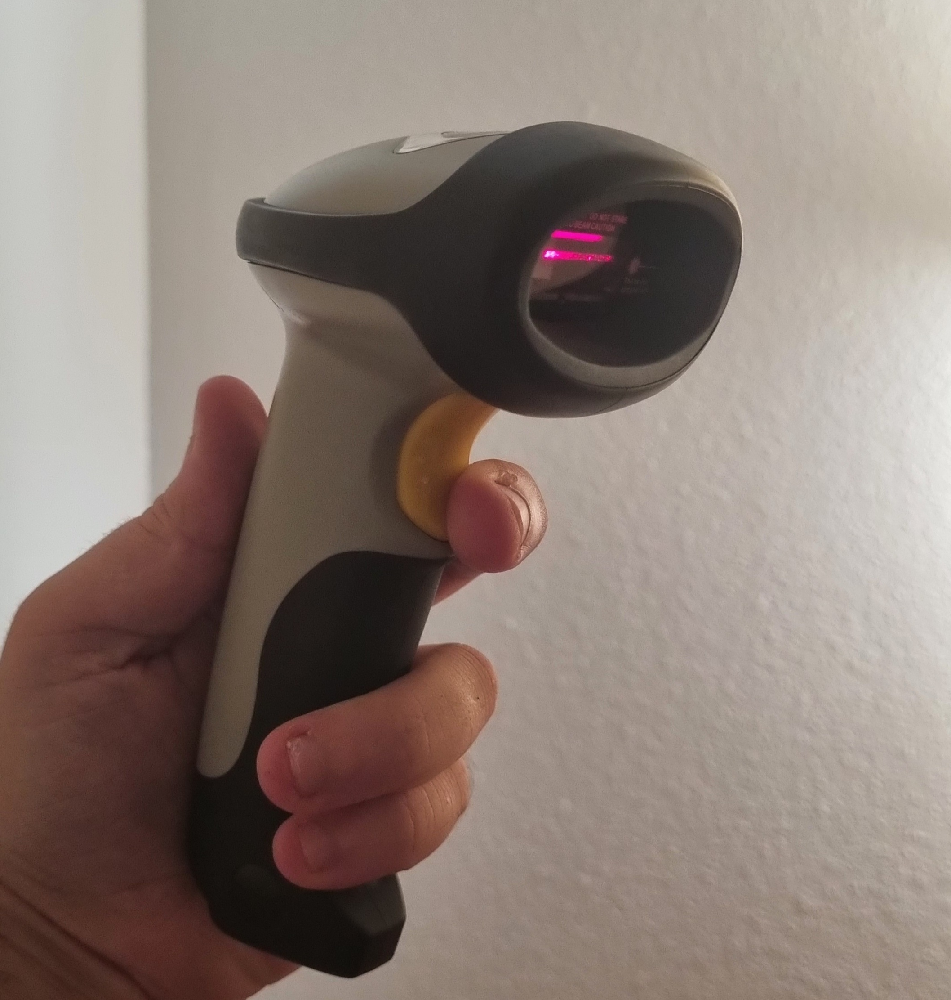

Lecteur de code barre
===========================================================

Le lecteur de code barre permet de simplifier l'utilisation du module stock en évitant de taper les références des articles entrant, sortants et des recherches.

    Scanner utilisé à EirLab Community

Installation
------------

Ce module nécessite `pyautogui` ainsi que le bluetooth pour fonctionner.

Exécuter la commande interactive `bluetoothctl` puis entrer les commandes suivantes :

- `scan on` : démarre la découverte des périphériques et repérer l'adresse MAC du périphérique à appairer
- `agent on` : démarre l'agent d'appairage
- `pair MAC-ADDRESS` : réalise l'appairage. Entrer le code PIN `10010` quand demandé
- `trust MAC-ADDRESS` : permet la reconnexion automatique

Ajouter le service `/etc/systemd/system/barcode-reader.service` avec l'adresse MAC de la douchette :

.. code-block::
    :caption: `/etc/systemd/system/barcode-reader.service`

    [Unit]
    Description=Barcode reader rfcomm binding service
    After=bluetooth.service

    [Service]
    Type=oneshot
    ExecStart=/usr/bin/rfcomm bind 0 00:06:62:3A:15:11 1

    [Install]
    WantedBy=multi-user.target

Et l'activer :

.. code-block::
    :caption: Enable service

    sudo systemctl enable barcode-reader.service

Le périphérique série est alors accessible à l'adresse `/dev/rfcomm0`.

SDK
---

.. automodule:: barcode
    :members:
    :undoc-members:
    :show-inheritance:
