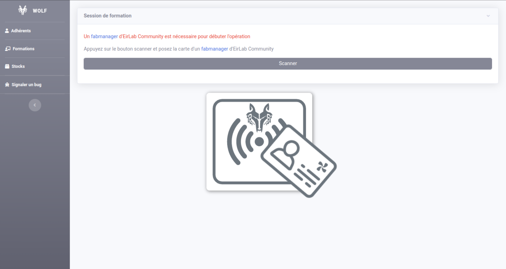
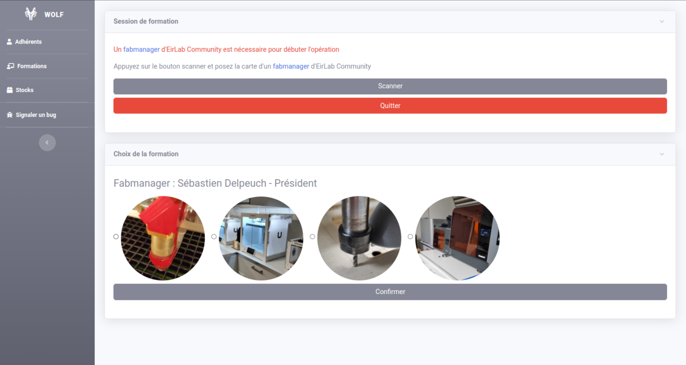
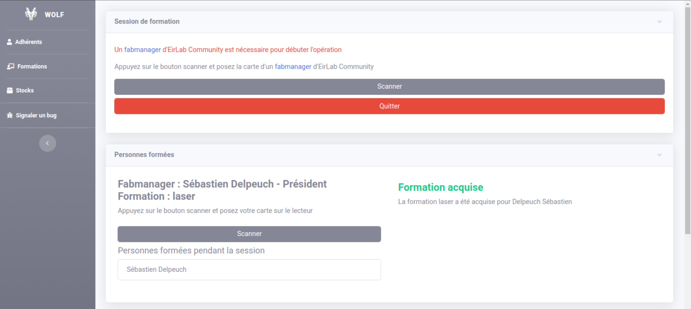
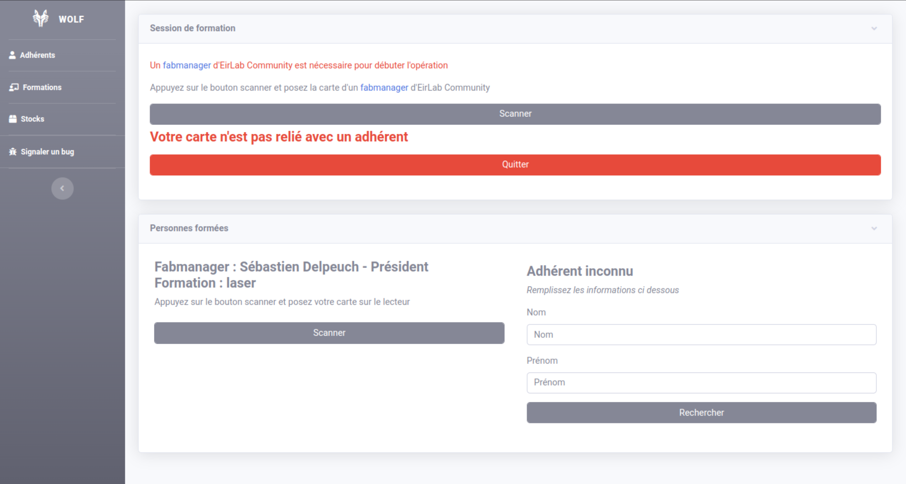
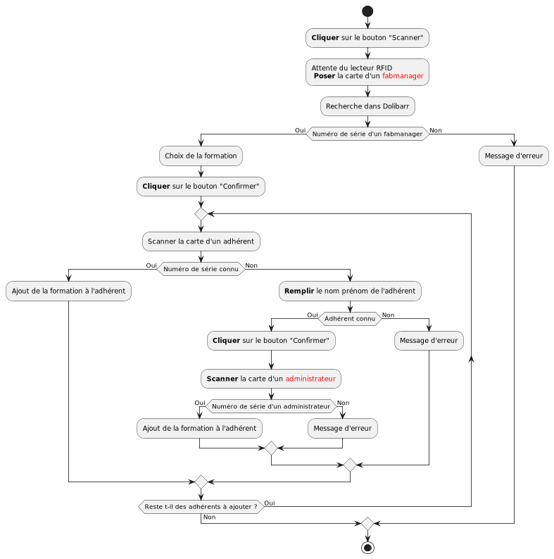

Formations
===========================================================

.. versionadded:: 1.2

    Le module formation permet d'ajouter une formation à un ou plusieurs adhérents

.. versionadded:: 2.4

    Le module formation permet de voir les formations futures

    Le module formation permet aux fabmanagers de s'inscrire à une formation

    Le module formation permet de mettre à jour le temps passé sur une formation par les fabmanagers

Utilisation
------------

Pour initier le module appuyez sur le bouton "Scanner", lorsque le logo de Wolf apparaît posez la carte étudiante / professionnelle d'un **fabmanager** sur le lecteur, celui ici emet un signal sonore lorsque la carte est lue.

    Attente de scan d'une carte

Si le fabmanager est reconnu il doit choisir la formation qu'il a donné aux adhérents.

    Choix de la formation

.. warning:: Un fabmanager ne peut donner que des formations qu'il a déjà acquis.

Il suffit ensuite d'appuyer sur le bouton scanner et de lire la carte étudiante / professionnelle de l'adhérent autant de fois qu'il y a d'adhérent à former. Pour chaque adhérent sa fiche mise à jour apparaît.

    Ajout d'une formation à un adhérent

Dans le cas où l'adhérent scanné n'est pas reconnu, il faut réaliser le lien entre sa carte et l'adhérent. Pour cela remplissez son nom et prénom puis cliquez sur confirmer et scanner la carte du fabmanager. Si l'adhérent est reconnu, il apparaît dans la liste et sa carte sera reliée. Sinon un message d'erreur apparaîtra.

    Liaison d'un adhérent inconnu

.. danger:: À la fin d'une session de formation, il faut cliquer sur le bouton **quitter* pour terminer l'enregistrement

SDK
----

    Diagramme d'activité du module formation

.. automodule:: formation
    :members:
    :undoc-members:
    :show-inheritance:

