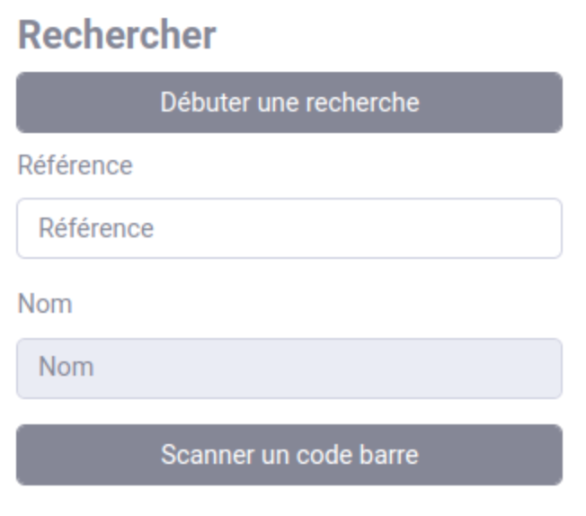
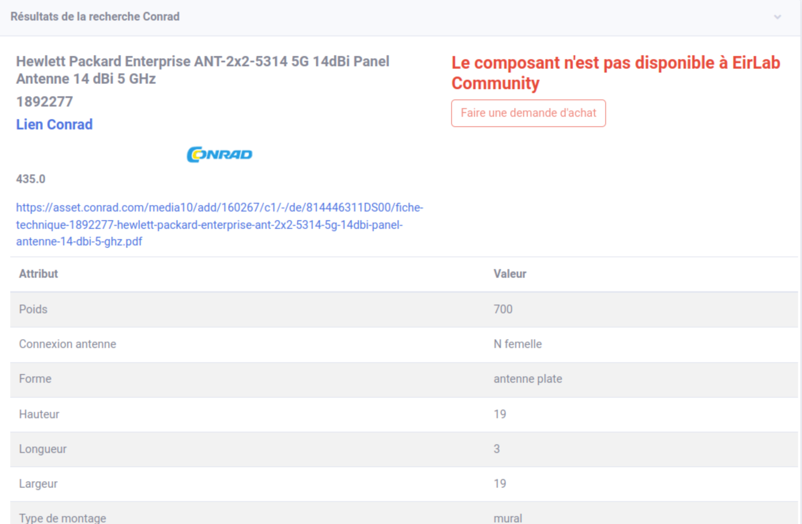
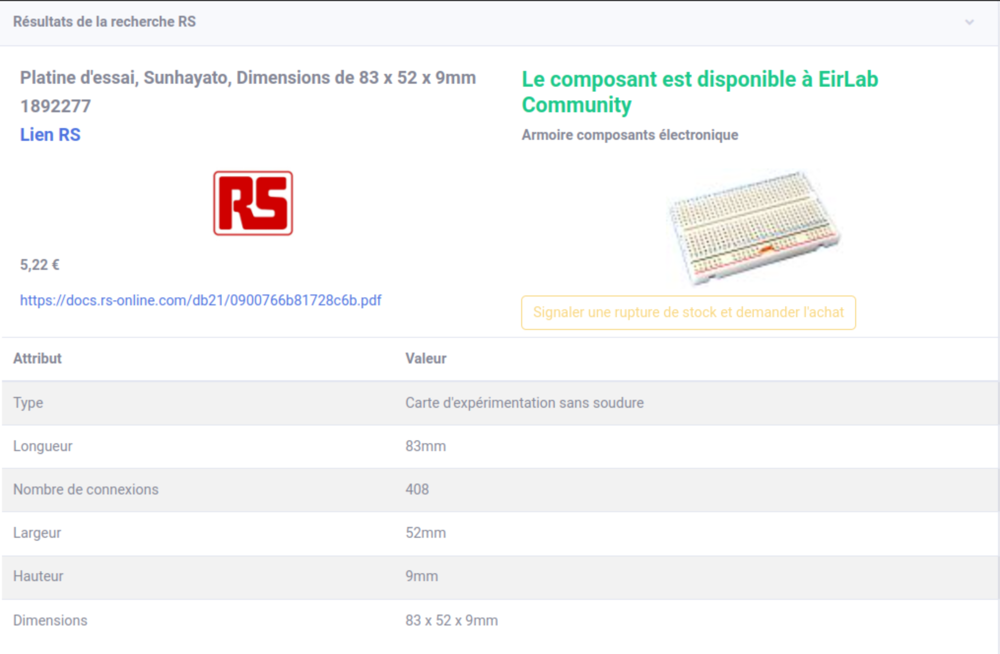
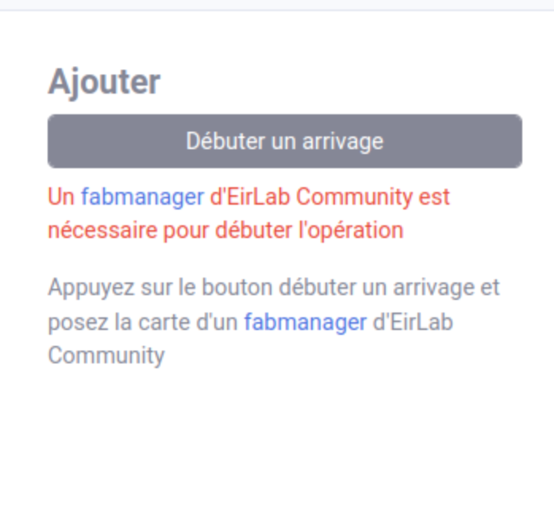
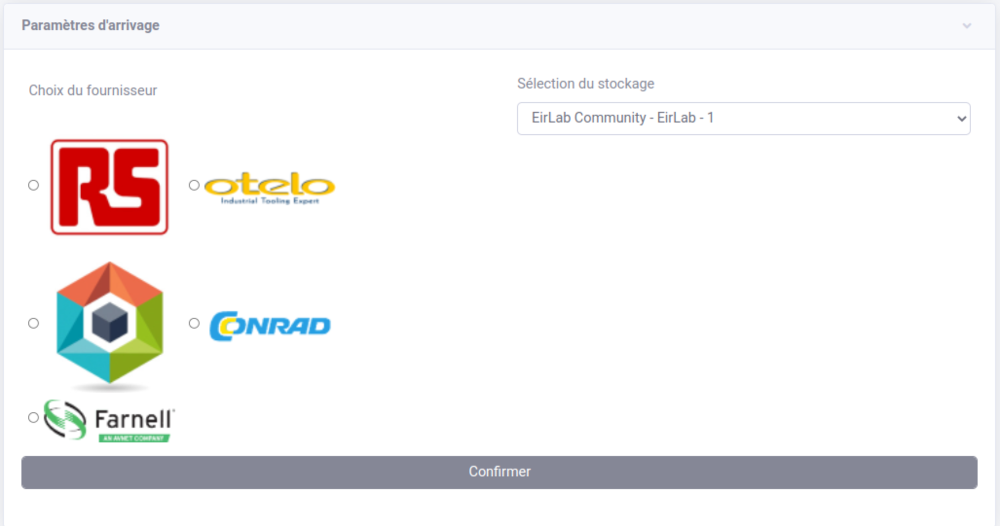
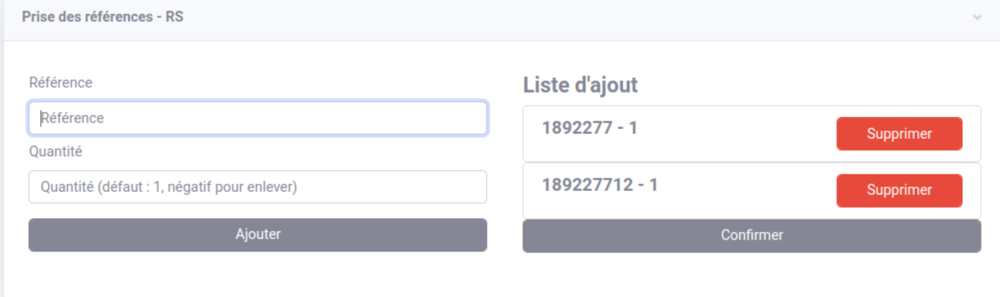
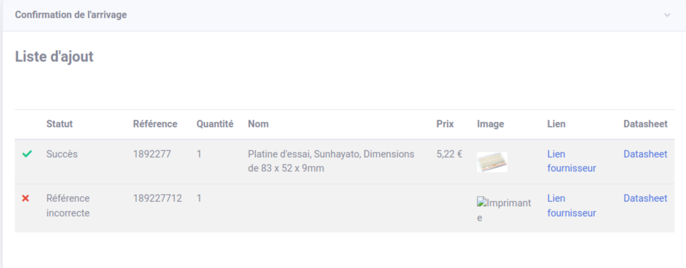
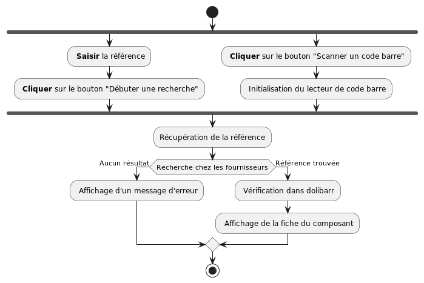
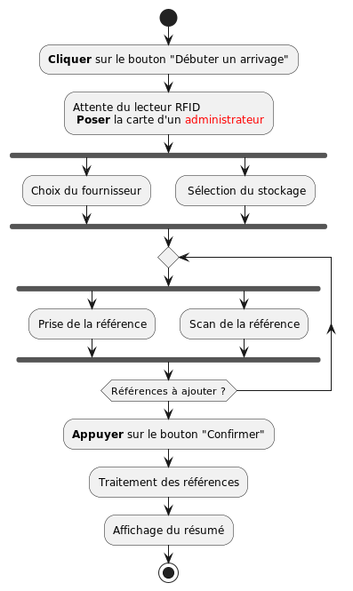

Gestion du stock
===========================================================

.. versionadded:: 2.0 Les fournisseurs RS, Otelo et Makershop sont accessibles depuis Wolf

.. versionadded:: 2.1 Ajout du fournisseur Conrad

.. versionadded:: 2.2 Ajout du fournisseur Farnell

Fonctionnalités en cours de développement :

- Recherche par noms
- Recherche uniquement dans le stock

Recherche d'un produit
-----------------------

La recherche de produit s'effectue via la **référence** du produit. Il est possible de la saisir à la main ou via un
lecteur de code barre. Pour débuter la recherche :

- Saississez la référence du produit puis appuyez sur le bouton "Débuter une recherche"
- Ou cliquez sur "Scanner un code barre", allumez le lecteur de code barre, attendez le signal sonore de connexion
  (deux bips courts) puis scannez votre référence.

    Débuter la recherche d'un produit

La recherche d'un produit chez tous les fournisseurs prend environ 10 secondes, une animation de chargement apparaît
le temps de la recherche. Lorsque la recherche est terminée la fiche du produit est affichées pour chaque fournisseur
possédant cette référence.

Si le composant n'est pas disponible dans le stock d'EirLab Community la fiche s'affiche avec la possibilité de faire
une demande de ce composant en remplissant un formulaire :

    Produit non disponible dans le stock

Dans le cas où le composant est disponible dans le stock, la fiche est affichée avec la possibilité de signaler une
rupture en remplissant un formulaire :

    Produit disponible dans le stock

.. warning:: Pour signaler une rupture ou demander un achat le remplissage méticuleux du formulaire est obligatoire.
             Dans le cas contraire la demande peut être ignorée.

Arrivages
----------

Le module d'arrivage s'initialise en cliquant sur le bouton "Débuter un arrivage", une fois cliqué il faut scanner la
carte d'un **fabmanager**.

    Débuter un arrivage

Une fois débuté il faut régler les paramètres de l'arrivage : choisir le **fournisseur** et le **lieu de stockage**.

    Paramètres de l'arrivage

Une fois les paramètres réglés la prise de référence peut commencer :

- Soit en rentrant les références à la main
- Soit en allumant le lecteur (appui long sur le bouton jusqu'à l'emission d'un long signal sonore) de code barre et en
attendant qu'il
se connecte
(2 courts signaux sonores) puis
en scannant
  les références.

La liste des références et la quantités sont affichées au fur et à mesure

    Références à ajouter

Lorsque toutes les références sont ajoutées, cliquez sur le bouton "Confirmer" pour valider l'arrivage. Le système va
chercher les références chez le fournisseur et mettre à jour le stock. Une fois terminé (environ 10 secondes) une
fiche résumée de l'arrivage est affichée.

    Confirmation de l'arrivage

SDK
----

    Diagramme d'activité de la recherche d'un produit

    Diagramme d'activité de l'arrivage de produits

.. automodule:: stock
    :members:
    :undoc-members:
    :show-inheritance:
